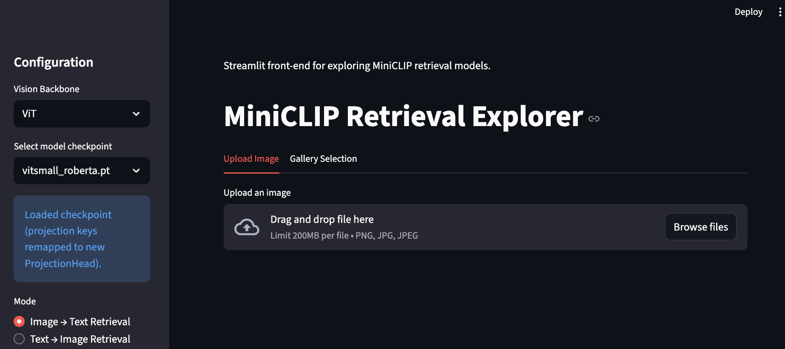
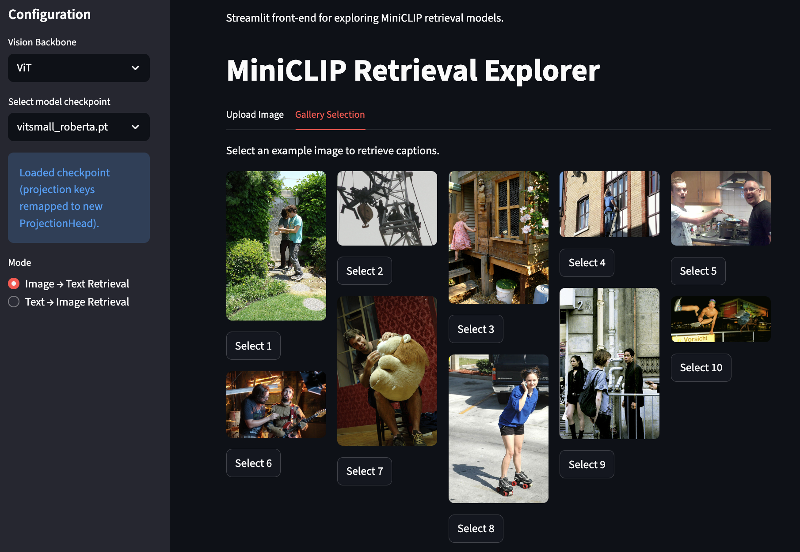
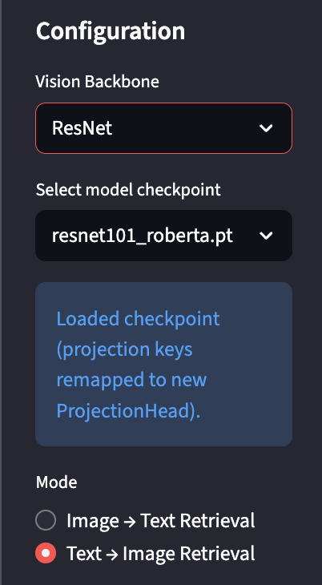
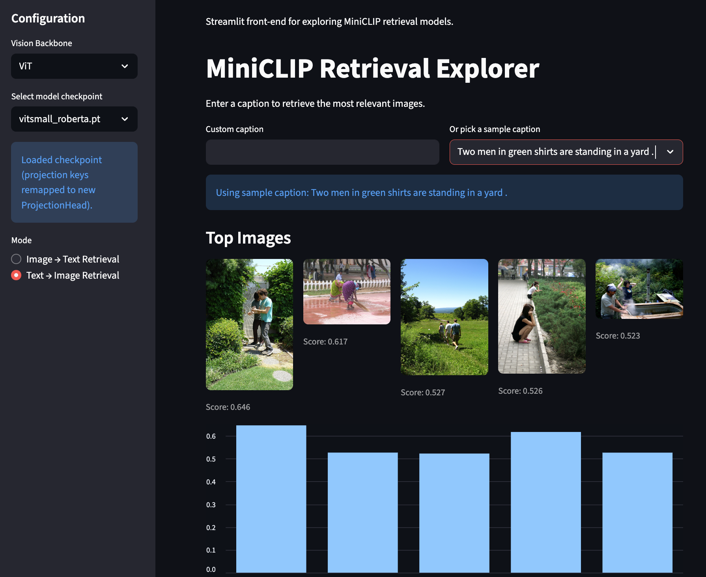

# miniCLIP_DL

Project repository for ES 667 - Deep Learning 

* Aditya Borate – 23110065
* Aryan Solanki – 23110049
* Nishchay Bhutoria - 23110222

Please find the original proposal here: [DL_Project_Proposal.pdf](report_and_slides/DL_Project_Proposal.pdf).
Please find the project slides here: [miniclip_slides.pdf](report_and_slides/miniclip_slides.pdf).

Additionally, you may access the [OpenAI Paper here](https://arxiv.org/pdf/2103.00020).

## Overview

We re-implemented a lightweight CLIP-style model (“MiniCLIP”) that pairs a transformer-based
vision encoder with a RoBERTa text encoder. The project compares three fine-tuning setups:

1. **Setup 1** – freeze both backbones and train only the projection heads (“last layer”).
2. **Setup 2** – full fine-tuning of the entire network.
3. **Setup 3** – full fine-tuning, followed by freezing everything except the last two transformer
   blocks in each encoder for stabilization.

We benchmarked both ViT(Small)+RoBERTa and ResNet101+RoBERTa against the CLIP
zero-shot baseline on 1,000 Flickr30k validation pairs. Final retrieval scores:

```
Inference evaluated on a subset of 1,000 Flickr30k test images.

Encoder Models          Fine-tune Method   I2T R@1  R@5  R@10   T2I R@1  R@5  R@10
---------------------------------------------------------------------------------
ViT(Small) + RoBERTa    Setup 1            21.6    53.6 65.2    22.4    50.4 64.2
ViT(Small) + RoBERTa    Setup 2            28.2    68.2 75.4    28.4    62.7 74.6
ViT(Small) + RoBERTa    Setup 3            36.6    72.7 83.8    33.9    71.9 84.0
ResNet101 + RoBERTa     Setup 1             5.7     6.9 15.2     5.5     6.3 14.9
ResNet101 + RoBERTa     Setup 2            22.1    49.4 61.7    20.7    48.3 61.0
CLIP (OpenAI)           Zero-shot          32.3    53.7 62.9    27.6    49.7 59.0
```

> Setup 1: fine-tune only the projection heads  
> Setup 2: fine-tune the entire model  
> Setup 3: full fine-tune, then freeze everything except the last two transformer blocks

## Pretrained Backbones

We rely on Hugging Face checkpoints to initialize both encoders:

- **ViT Small** (`facebook/dino-vits16`): <https://huggingface.co/facebook/dino-vits16>
- **ViT Base** (`google/vit-base-patch16-224`): <https://huggingface.co/google/vit-base-patch16-224>
- **RoBERTa Base** (`roberta-base`): <https://huggingface.co/roberta-base>
- **ResNet-101** (Torchvision pretrained weights): <https://huggingface.co/pytorch/vision-resnet-101>

## Released MiniCLIP Checkpoints

| Model | Link | Notes |
| ----- | ----- | ----- |
| ViT Small + RoBERTa | [HexAryan/vitsmall_roberta](https://huggingface.co/HexAryan/vitsmall_roberta) | Full fine-tuning followed by last-two-layer stabilization (Setup 3). |
| ResNet101 + RoBERTa | [HexAryan/resnet101_roberta](https://huggingface.co/HexAryan/resnet101_roberta) | Full-model fine-tuning on Flickr30k (Setup 2). |

## Repo Layout

- `experiments/`: training scripts for the three setups (plus CLI evaluators).
- `trial/`: original notebooks/scripts used while prototyping.
- `app/`: Streamlit frontend for quick retrieval demos, plus a helper to precompute embeddings.

## Datasets

We use Flickr30k (downloaded from [Kaggle](https://www.kaggle.com/datasets/adityajn105/flickr30k?resource=download))
for both training and evaluation. Place the images under `data/flickr30k/Images` (or inside
`app/data/flickr30k/Images` for the Streamlit app) and the captions file next to them.

## Training / Evaluation

Within `experiments/`, the standard routines are:

```bash
# Setup 1 (projection heads only)
python train.py

# Setup 2 (full finetune)
python train_full.py

# Setup 3 (partial finetune)
python train_partial.py
```

Each script writes checkpoints under `experiments/checkpoints*`. To evaluate retrieval
without launching the app:

```bash
python inference_batch.py --num-samples 800 --topk 10
```

## Streamlit App

1. Drop your trained checkpoints into `app/models/`
   (e.g. `app/models/vitsmall_roberta.pt`, `app/models/resnet101_roberta.pt`).
2. Copy Flickr30k images/captions into `app/data/flickr30k/`.
3. Precompute embeddings for each checkpoint:

   ```bash
   cd /Users/aryan/Desktop/Academics/Semester5/DL/project/miniCLIP_DL
   source trial/.venv/bin/activate
   python app/prepare_embeddings.py \
      --checkpoint app/models/vitsmall_roberta.pt \
      --output app/data/vitsmall_roberta_embeddings.pt \
      --captions app/data/flickr30k/captions.csv \
      --image-root app/data/flickr30k/Images \
      --limit 800
   ```

4. Launch the UI with `streamlit run app/app.py`. Pick the checkpoint from the sidebar and
   explore both Image→Text and Text→Image retrieval.  


## Screenshots / demo space:









